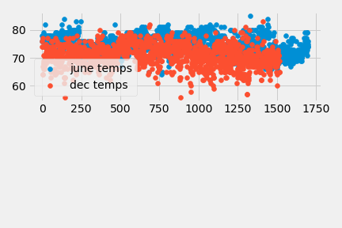
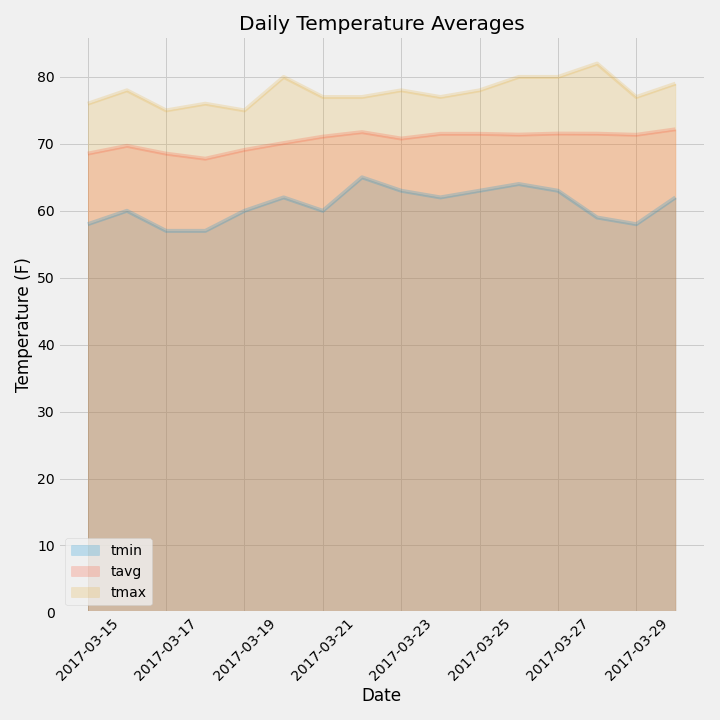

# Analysis and API of Hawaiian Climate

- **_Climate Analysis_** - [`climate.ipynb`](climate.ipynb) is a Jupyter Notebook that uses climate data from a Sqlite database that covers the Hawaiian Islands. The jupyter notebook uses SQLAlchemy to load the data so we can do some analysis on temperature and precipitation across several Hawaiian collection stations.

- **_Climate Flask API_** - Using the sqlite database from the **_Climate Analysis_** write a series of APIs in Python Flask to retrive data from the Hawaiian Sqlite database.

## Files

- Climate Analysis

  - [`climate.ipynb`](climate.ipynb) - Jupyter Notebook for the **_Climate Analysis_** including the bonus section for additional anaylsis.

- Climate Flask API

  - [`app.py`](app.py) - Python source code for providing a series of endpoints based upon the Sqlite climate database used for the **_Climate Analysis_**. The idea was to encapsulate many of the data queries done in the analysis and turn them into APIs.

- Common Files

  - [`hawaii.sqlite`](Resources/) - The database with the Hawaiian climate data, prepopuated and ready to go (Please don't open directly as it is a binary file)

  - [`hawaii_measurements.csv`](Resources/hawaii_measurements.csv) - Seed data for Hawaiian climate data for measurements taken from each of the Hawaiian stations.

  - [`hawaii_stations.csv`](Resources/hawaii_stations.csv) - Seed data for Hawaiian climate measurement stations.

## Results

- Climate Analysis

  - Rain in Inches by Date for all Hawaii Stations

    

  - Most Active Station Temperature History

    

- Bonus Analysis

  - T Tests

    

    

    Ttest_indResult(statistic=31.355036920962423, pvalue=4.193529835915755e-187)

  - Average Temperature for Trip

    

  - Average Daily Temperature for Trip

    

- Climate Flask API

  Please use the following APIs URIs to see the results:

  - /
  - /api/v1.0/precipitation
  - /api/v1.0/stations
  - /api/v1.0/tobs
  - /api/v1.0/tobs/&lt;start&gt;
  - /api/v1.0/tobs/&lt;start&gt;/<&lt;end&gt;

  If you running local and using defaults post-pend these URIs to http://127.0.0.1:5000\
  &lt;start&gt; = a date with a format of YYYY-MM-DD (Any other format will result in error)\
  &lt;end&gt; = a date with a format of YYYY-MM-DD (Any other format will result in error)

## Analysis

1. Please see charts above
1. T-Test - Based on the charts and ttest results temperatures are statistically different between June and December, As such we can reject the null hypothesis. I chose to use the two sample t-test because I have 2 independent groups.

## Execution

1. For the **_Climate Analysis_** material the assumption is that you have a working Python 3.6 environment and:

   - Jupyter Notebook 6.1.4
   - SQLAlchemy 1.3.17
   - pandas 1.0.5
   - matplotlib 3.2.
   - numpy 1.18.5

1. Clone the [`git repository`](https://github.com/jayhjman/sqlalchemy-challenge) for this project

1. Change into the [`repository directory`](https://github.com/jayhjman/sqlalchemy-challenge)

1. Load and execute [`climate.ipynb`](climate.ipynb)

1. For the **_Climate Flask API_** material the assumption is that you have a working Python 3.6 environment and:

   - SQLAlchemy 1.3.17
   - numpy 1.18.5
   - Flask 1.1.2

1. Use the previously cloned [`git repository`](https://github.com/jayhjman/sqlalchemy-challenge) from above

1. Change into the [`repository directory`](https://github.com/jayhjman/sqlalchemy-challenge)

1. Execute [`app.py`](app.py) by typing the command `python app.py` at command line

1. Access via the browser `http://127.0.0.1:5000/` this will show you the API specifications, call each in turn, providing parameters when required

## Author

Made by Jay with :heart:&nbsp;in 2020.
