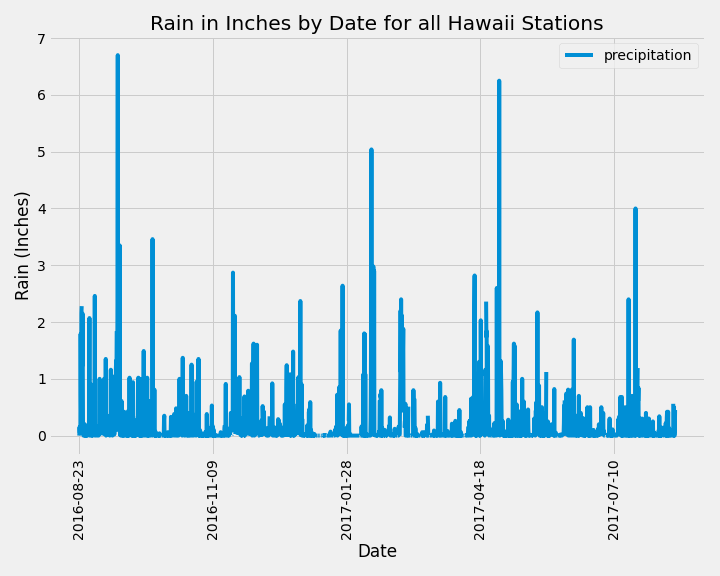

# Analysis and API of Hawaiian Climate

- **_Climate Analysis_** - [`climate.ipynb`](climate.ipynb) is a Jupyter Notebook that uses climate data from a Sqlite database that covers the Hawaiian Islands. The jupyter notebook uses SQLAlchemy to load the data so we can do some analysis on temperature and precipitation across several Hawaiian collection stations.

- **_Climate Flask API_** - Using the sqlite database from the **_Climate Analysis_** write a series of APIs in Python Flask to retrive data from the Hawaiian Sqlite database.

## Files

- Climate Analysis

  - [`climate.ipynb`](climate.ipynb) - Jupyter Notebook for the **_Climate Analysis_** including the bonus section for additional anaylsis.

- Climate Flask API

  - [`app.py`](app.py) - Python source code for providing a series of endpoints based upon the Sqlite climate database used for the **_Climate Analysis_**. The idea was to encapsulate many of the data queries done in the analysis and turn them into APIs.

## Results

- Climate Analysis

  

## Analysis

1. Placeholder 1
1. Placeholder 2

## Execution

1. You will need Postgres and pgadmin4 to execute the following from the EmployeeSQL (assumption, you have a working, installed Postgres)

   - [`create-objects.sql`](EmployeeSQL/DDL/create-objects.sql) - please execute the SQL against your database and schema in the order they appear in the file (take note of the database name, user, schema and password for **_Bonus_** part below)

   - Inside of pgadmin4 traverse to the created tables and one at a time in the order listed import the data from the following CSV files into the named tables:

   - [`departments.csv`](EmployeeSQL/Resources/departments.csv)
   - [`titles.csv`](EmployeeSQL/Resources/titles.csv)
   - [`employees.csv`](EmployeeSQL/Resources/employees.csv)
   - [`dept_emp.csv`](EmployeeSQL/Resources/dept_emp.csv)
   - [`dept_manager.csv`](EmployeeSQL/Resources/dept_manager.csv)
   - [`salaries.csv`](EmployeeSQL/Resources/salaries.csv)

   - You can now execute the [`analysis.sql`](EmployeeSQL/Analysis-SQL/analysis.sql) to get the query results.

1. For the **_Bonus_** material make sure EmployeeSQL steps above are complete and the database exists, the assumption is that you have a working Python 3.6 environment and:

   - Jupyter Notebook 6.1.4
   - SQLAlchemy 1.3.17
   - pandas 1.0.5
   - matplotlib 3.2.2
   - sqlparse 0.4.1

1. Clone the [`git repository`](https://github.com/jayhjman/sql-challenge) for this project
1. Change into the [`repository directory`](https://github.com/jayhjman/sql-challenge) and then into [`Bonus`](Bonus/)
1. In the `Bonus` directory create a file called `config.py` and add the following lines:

   - db_name="YOUR DB NAME"
   - db_user="YOUR DB USER NAME"
   - db_password="YOUR PASSWORD"
   - db_schema="YOUR SCHEMA NAME"

   Replace the values in the double quotes above with your database's specific settings

1. Once `config.py` is saved open up Jupyter Notebook in the `Bonus` directy and load and execute [`Bonus.ipynb`](Bonus/Bonus.ipynb)

## Author

Made by Jay with :heart: in 2020.
